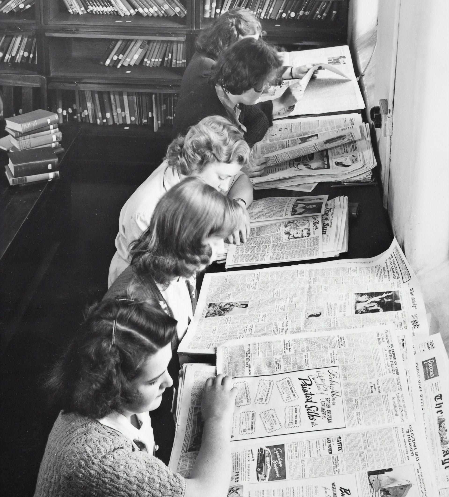

### Мир не идеален: получать нужные сведения по-прежнему сложно и неприятно.

Все собирают лендинги из одинаковых блоков, наполняя их сырым текстом.
Слишком много текста и дизайна. Форма почему-то важнее смысла.

Тезисы, напротив, компактны, и заключают в себе смыслы.
Нужно потрудиться, чтобы изложить последовательность тезисов - исчерпать тему коротко и по сути.
Иначе мало здравого смысла, и много бреда, и трудно быть понятым.

Любой конкретный бизнес отличается от других - это факт.
Не нужно выделяться дизайном, который вообще-то затрудняет восприятие.
Намного лучше зайти с другой стороны - рассказать о себе доходчиво и по делу.

Вот почему легкий компактный сайт - это хорошо, и почему лендинги такие "нехорошие".

# Бумажные сайты

Доведите понятность вашего бизнеса/сайта в интернете до 100%.

Сайт можно назвать бумажным, если его настолько же легко прочитать и понять, как если бы он был напечатан на листе бумаги в виде газеты или как документ.

Как это связано с конверсией посетителей сайта в покупателей? Напрямую?

Посетитель - это деньги трех видов:
- потраченные - на то чтобы он пришел на сайт
- упущенные - если человек не смог разобраться или ему что-то не понравилось - он мог купить у вас, но... <a href="/about-papers" class="more">Читать ≫</a>

## Принципы адекватного подхода

Что важно, а что нет для сайта. Перечень мыслей, умозаключений, выводов, правил. <a href="/principles" class="more">Читать ≫</a>

## Технологии и преимущества

Какие технологии мы используем, и какие преимущества вы получаете в результате. <a href="/technologies" class="more">Читать ≫</a>

## Цены и условия

Как вы думаете, средняя цена разработки сайта в Москве больше или меньше 160 000 рублей?

**В июне цена за стандартную работу фиксирована - 80 000 рублей.** В эту сумму входит создание стандартного сайта <small>(такого же как этот - kon-kh.ru, см. также раздел Принципы адекватного подхода)</small> на базе готовых текстов (предоставленных либо со старого сайта), создание аккаунтов на Github и Netlify, привязка домена, запуск сайта в работу.

У вас на руках окажется работающий сайт, в который вы сможете вносить правки в любое время (сайт незаметно обновится).

<a href="/prices" class="more">Читать ≫</a>

---

### Зачем вам сайт
Короткий список доводов "за" иметь и развивать собственный сайт в сети.

<a href="/arguments" class="more">Читать ≫</a>

