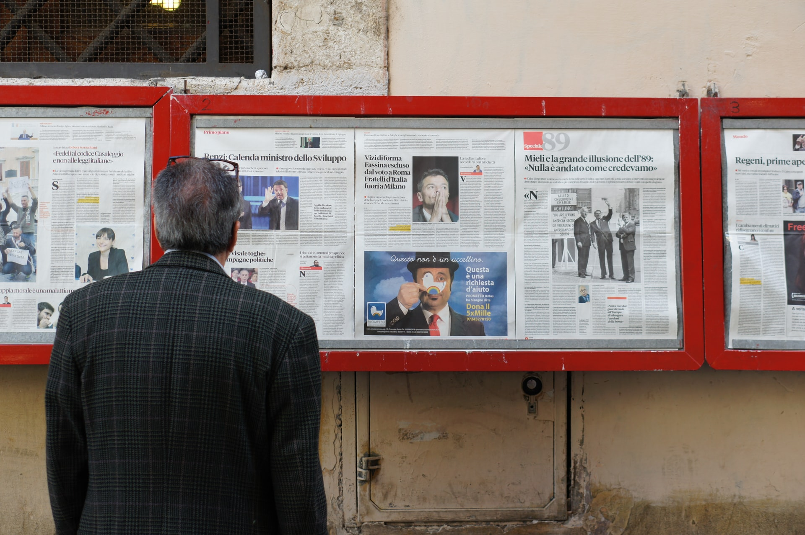

# Принципы адекватного подхода

Что важно, а что нет для сайта. Перечень мыслей, умозаключений, выводов, правил.

У сайта простой стандартный дизайн, такой же как у многих других. *Чем больше таких сайтов в сети, тем привычнее посетителям - им все здесь знакомо.*

Выделяться/отличаться от остальных нужно содержательно. *Но это и так есть - ваш бизнес уникален - просто расскажите о себе, и эта цель будет достигнута.*

Сайт должен быть аккуратным, приятным глазу. *Можно взять macos/операционную систему от Apple и стандартные приложения в ней такие, как Pages/Numbers, в качестве ориентира простоты и удобства.*

Типографика - внимание к тому как выглядит текст и как воспринимаются текстовые блоки. **Шрифты сайта можно подобрать в бесплатной коллекции** <a target="_blank" href="https://fonts.google.com/">Google Fonts</a>.

**Добиться чтобы сайт выглядел похожим на реальную газету/листовку, т.е. сделать его бумажным.** *Бумажный сайт - это просто идея, которая интуитивно кажется что вписывается в эту последовательность принципов.*

Информацию нужно ужимать, делать ее компактной. На планшете/мониторе весь текст желательно уместить в один экран - вся информация в прямой доступности. *Посетители расстраиваются, когда информация размазана по сложной структуре сайта, и требуется кликать и мотать туда-сюда, тратить время на простое казалось бы дело - узнать.*

Минимум текстов. Быстро прочитать все и уйти думать/принимать решение. Коротко и по делу ответить на вопросы потенциального/реального клиента. Постараться не разозлить/отпугнуть его своей непонятностью или хитростью.

Минимум изображений, и те что есть желательно должны быть реальными фотографиями вашего бизнеса.

Никакой анимации - это утомляет, когда все плавает. Особенно никаких дрожащих или мерцающих кнопок и проч.

Никаких автоматически всплывающих окон - все призывы к действию уже на экране.

Никаких запросов включить уведомления - этот функционал для веб-приложений, он неуместен для сайта бизнеса.

Вообще, по возможности, лучше не раздражать посетителя навязчивыми ботами, формами обратной связи с требованием дать согласие на обработку персональных данных и т.п. <small>Если у вас есть CRM, то возможно вы захотите в будущем привязать как можно больше каналов связи, в том числе бота и форму на сайте.</small>
