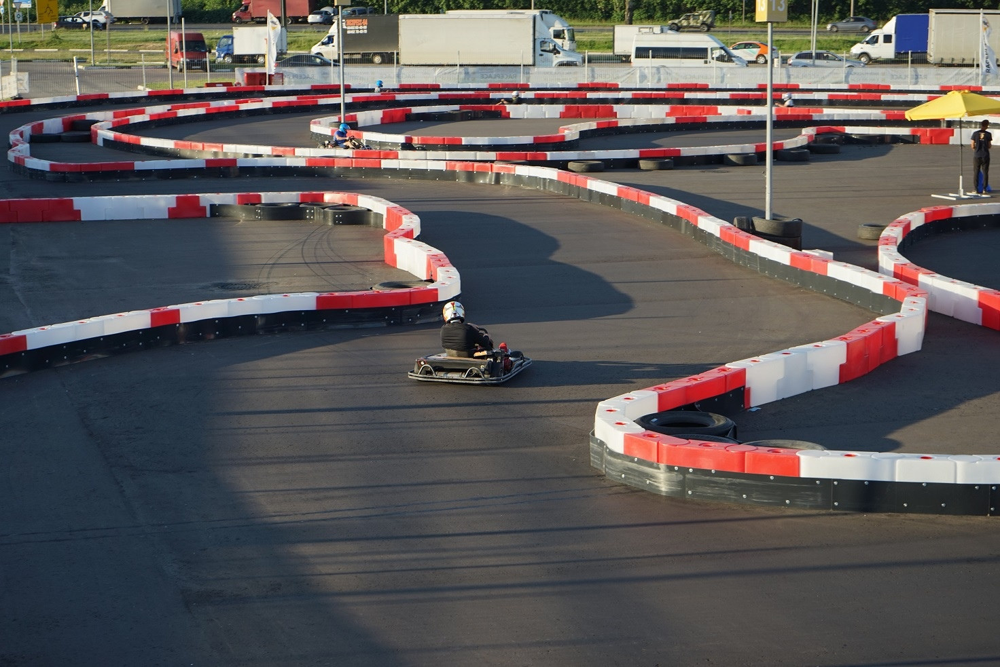
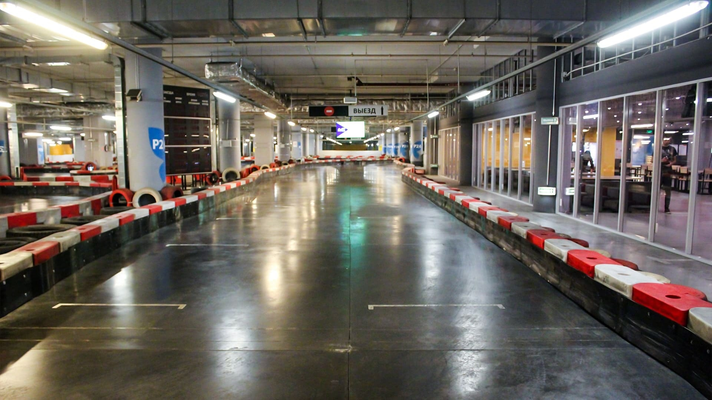

[comment]: <> (ГЛАВНАЯ СТРАНИЦА - СОДЕРЖИТ ВСЕ ТЕМЫ И ОТСЫЛАЕТ ЧИТАТЬ ПОДРОБНОСТИ НА ДР. СТРАНИЦЫ)

[comment]: <> (БЛОК С ГЛАВНОЙ СТАТЬЕЙ)

[comment]: <> (БЛОК С ГЛАВНОЙ СТАТЬЕЙ, ПЕРВЫЙ ПОДБЛОК)

<video autoplay class="video" height="auto" width="100%" loop controls>
<source src="/race-place.webm" type="video/webm">
</video>

# Картинг-Центр RacePlace

Место где живут гонки.

Картинг - это лучшие эмоции!
Мы собираемся, чтобы погонять и пообщаться.
На трассе мы соперники, вне трассы - друзья.

[comment]: <> (БЛОК С ГЛАВНОЙ СТАТЬЕЙ, ПЕРВЫЙ ПОДБЛОК)

### Карты

Все машины известных марок с многолетней историей в мировом прокатном картинге.
Каждый болид сертифицирован и прошел проверку.
У нас **быстро равно безопасно**.

<a href="/demo/race-place-page" class="more">Читать подробнее ≫</a>

### Онлайн-табло

- Моментальные данные по заезду.
- Отслеживайте личную статистику по каждому заезду.
- Сравнивайте время прохождения круга с другими гонщиками.
- Соревнуйтесь в рейтинге самых быстрых пилотов дня, недели и месяца.

<small>Хронометраж интегрирован с системами RaceMann и RaceFacer - глобальным сообществом картингистов. Данные обновляются в режиме онлайн!</small>

<a target="_blank" rel="noopener nofollow" href="https://raceplace.racemann.ru/home/last#race" class="more">RaceMann.ru ≫≫≫</a> <a target="_blank" rel="noopener nofollow" href="https://www.racefacer.com/ru/karting-tracks/russia/raceplacemoscow" class="more">RaceFacer.com ≫≫≫</a>

[comment]: <> (БЛОК С ТЕЗИСАМИ)

[comment]: <> (БЛОК С ТЕЗИСАМИ, ПЕРВЫЙ ПОДБЛОК)

## Трасса в ТРЦ "Июнь"

Полностью безопасная крытая трасса на теплой вентилируемой подземной парковке.
- 300 метров
- 12 поворотов

**пн-чт с 11 до 22 / пт-вс с 11 до 23**

<a target="_blank" rel="noopener nofollow" href="tel:+74994502665"><strong>+7 (499) 450-26-65</strong></a>

<a target="_blank" rel="noopener nofollow" href="https://yandex.ru/profile/23887345929" class="ext-link">г. Мытищи, ул. Мира, 51. ТРЦ "ИЮНЬ"</a>

---

## Трасса МЕГА Химки

Полностью безопасная открытая трасса на свежем воздухе.
- 400 метров
- 11 поворотов

**пн-вс с 11 до 22**

<a target="_blank" rel="noopener nofollow" href="tel:+74994606224"><strong>+7 (499) 460-62-24</strong></a>

<a target="_blank" rel="noopener nofollow" href="https://yandex.ru/profile/223315505074" class="ext-link">г. Химки, 8-й микрорайон, 4. МЕГА Химки</a>

[comment]: <> (БЛОК С ТЕЗИСАМИб ВТОРОЙ ПОДБЛОК)

<iframe style="pointer-events: none;" src="https://yandex.ru/map-widget/v1/?um=constructor%3Ad1beb05d2b97d76c04d4dd4a462cb2c51028d60ce9199ab7197f5511a1a83fee&amp;source=constructor" width="100%" height="240" frameborder="0"></iframe>

[comment]: <> (СТАТЬЯ 2 - ТРЕТЬЯ КОЛОНКА, ВЕРХНИЙ БЛОК)

## Школа картинга

Возможности и условия обучения в группах, персональные тренировки, летние курсы.
<a href="/demo/race-place-page" class="more">Читать ≫</a>

## Гонки

Регистрация на гоночные события RacePlace.
<a href="/demo/race-place-page" class="more">Открыть ≫</a>

### Услуги

- Праздники под заказ - на высоких скоростях  <a href="/demo/race-place-page" class="more">Ознакомиться ≫</a>
- Спортивный картинг  <a href="/demo/race-place-page" class="more">Прочитать ≫</a>
- Выездной картинг  <a href="/demo/race-place-page" class="more">Больше ≫</a>
- Реклама в RacePlace  <a href="/demo/race-place-page" class="more">Узнать ≫</a>

[comment]: <> (СТАТЬЯ 3 - ТРЕТЬЯ КОЛОНКА, НИЖНИЙ БЛОК)

## Правила / порядки

- Обязательная экипировка - шлем, комбинезон и т.д.
- Маршал на трассе следит за безопасностью.
- В заезде машины одного класса - чтобы честно.
- Максимальная защита за счет ограждения трассы.

<a href="/technologies" class="more">Читать подробнее ≫</a>

[comment]: <> (СТАТЬЯ 4 - ЧЕТВЕРТАЯ КОЛОНКА)

[comment]: <> (СТАТЬЯ 4, ПЕРВЫЙ БЛОК)

[comment]: <> (СТАТЬЯ 4, ВТОРОЙ БЛОК)

## Цены / планы

Выберите подходящий вам тарифный план.

- Тренировки
- Стандарт
- Марафон
- Мини-гонка

Например, самый популярный формат - стандартный заезд на 10 минут (это 10-20 кругов).
Цена в будни после 18:00 на взрослый карт составит **800₽**. 

<a href="/demo/race-place-page" class="more">Читать подробнее ≫</a>

---

### Подарочные сертификаты

   |  
 :--- | ---:
 Сертификат 1000 | **1000 ₽**
 Сертификат 3000 | **3000 ₽**
 Сертификат 5000 | **5000 ₽**
 Персональная тренировка | **4000 ₽**
 Абонемент на 2 месяца | **8500 ₽**
 Абонемент на 3 месяца | **12000 ₽**

**Лучший подарок - это впечатления.** Подарите их - это просто!

<a href="/arguments" class="more">Подробнее ≫</a>

